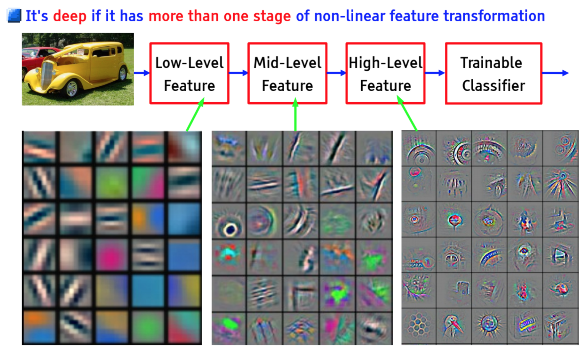

# Deep Learning

This is the repository for notes and projects for course [02456 Deep Learning](http://kurser.dtu.dk/course/02456) at DTU.

## Resources
* [Google Docs File](https://docs.google.com/document/d/1UYpSF3FguEDg_AT3Vtczj5-DAjdICyHEA3L4KQIOPjo/edit)
* [Deep Learning Book](http://www.deeplearningbook.org)
* [Neural Networks And Deep Learning Book](http://neuralnetworksanddeeplearning.com)

## Week One
* Deep Learning
  * Reinforcement learning - how you act now affects the environment some time after.
  * Deep learning (formerly known as neural networks) is about Learning in Hierarchical Representations

* Neural Networks in general
  * Every neuron in a Neural Network has an activation energy. A neuron's activation energy is equal to sum of each products of an incoming edge and the activation energy of the node it is coming from.
  * A bias term can also be added to the sum to act as a threshold or simply to center data away from zero.
  * Any neuron should have an activation in the range [0,1]. A squashing function can be used to compress sums that lay outside this range.

* Feed Forward Neural networks (FFNN)
  * Supervised learning (input, output)
  * Well-suited for classification
  * Train conditional model

## Week Two
